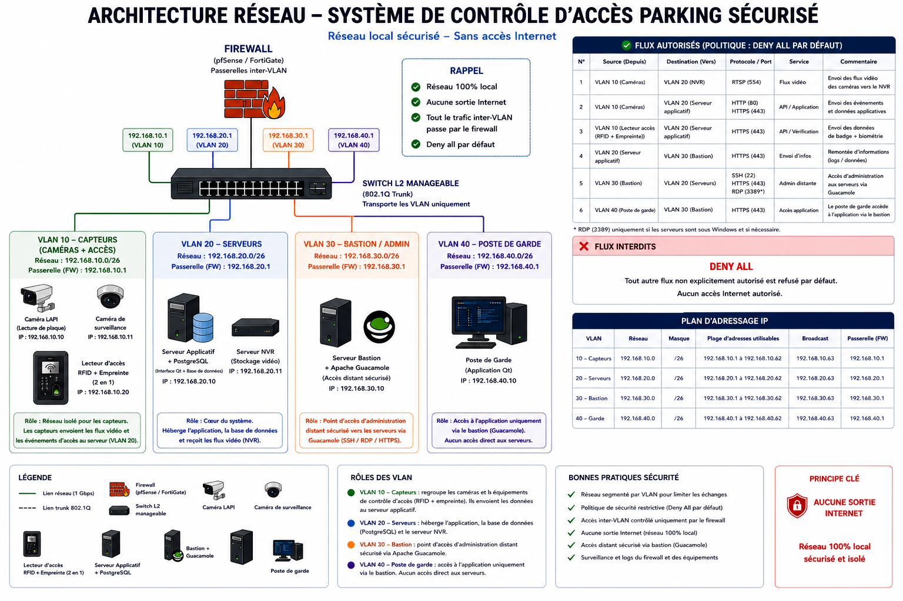
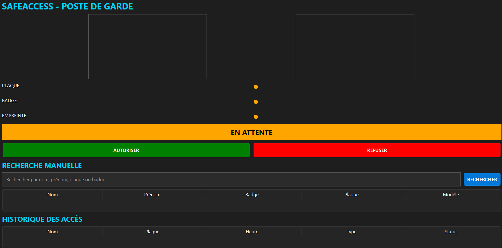
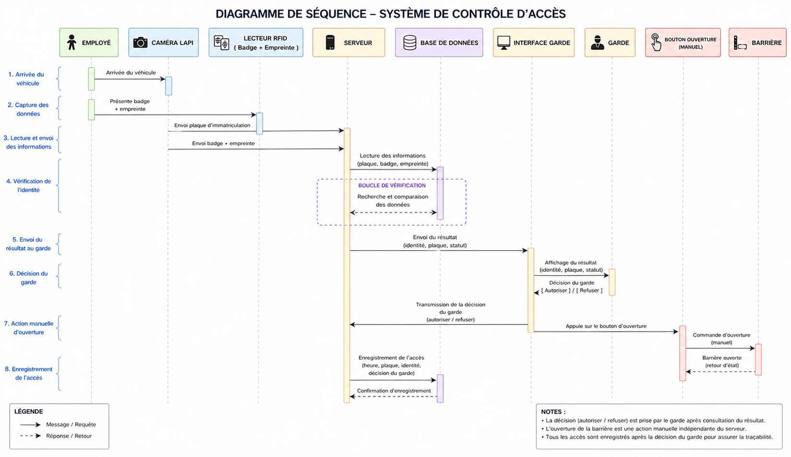
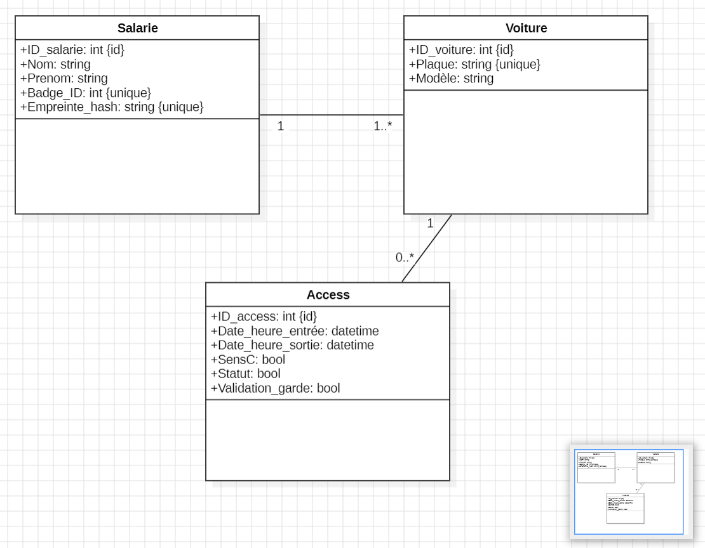
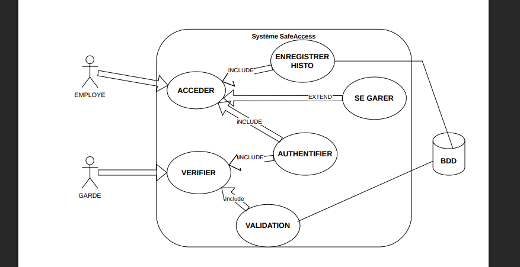

# SafeAccess – Parking Sécurisé

> Projet BTS CIEL Cybersécurité 2024–2026 |

Système de contrôle d'accès sécurisé pour parking industriel basé sur une
authentification multi-facteurs et une architecture réseau segmentée.

## Présentation

SafeAccess sécurise l'accès au parking d'un site industriel sensible
(Jeumont Electric) via trois facteurs combinés :

- Lecture automatique de plaque (caméra LAPI + OCR)
- Badge RFID
- Empreinte digitale (lecteur biométrique 2-en-1)

Un agent de sécurité supervise chaque accès via une interface dédiée
et prend la décision finale (autoriser / refuser).

## Architecture réseau

## Interface de supervision (poste de garde)

## Diagrammes UML

### Diagramme de séquence

### Diagramme de classes

### Cas d'utilisation

## Stack technique

| Composant | Technologie |
|-----------|-------------|
| Interface garde | C++ / Qt |
| Base de données | PostgreSQL |
| Réseau | 4 VLAN segmentés, Firewall Deny All |
| Administration distante | Bastion + Apache Guacamole |
| Stockage vidéo | Serveur NVR |

## Fonctionnement

1. Le véhicule arrive → la caméra LAPI lit la plaque
2. L'employé badge + empreinte digitale
3. Le serveur vérifie les 3 facteurs en base de données
4. Le résultat s'affiche sur l'interface du garde
5. Le garde valide ou refuse manuellement
6. L'événement est enregistré avec horodatage

## Sécurité réseau

| VLAN | Rôle | Réseau |
|------|------|--------|
| VLAN 10 | Capteurs (caméras + RFID/empreinte) | 192.168.10.0/26 |
| VLAN 20 | Serveurs (applicatif + NVR) | 192.168.20.0/26 |
| VLAN 30 | Bastion / Apache Guacamole | 192.168.30.0/26 |
| VLAN 40 | Poste de garde (interface Qt) | 192.168.40.0/26 |

- Politique **Deny All** par défaut sur le firewall
- Réseau 100% local, aucune sortie Internet

## Structure du repo

## Auteur

**Esteban HUCKEN** – BTS CIEL Cybersécurité
Session 2024–2026